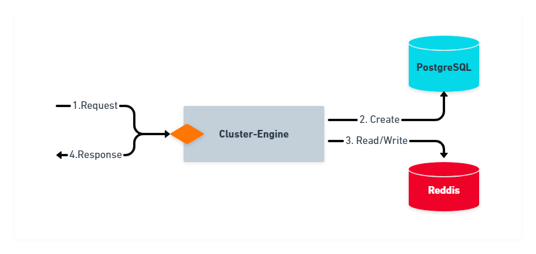
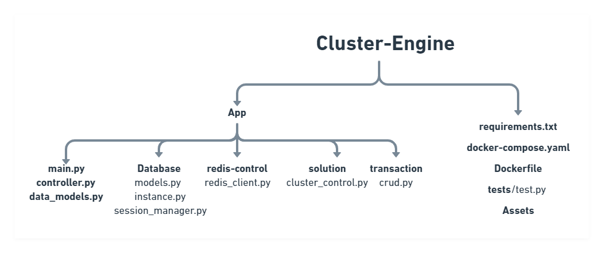
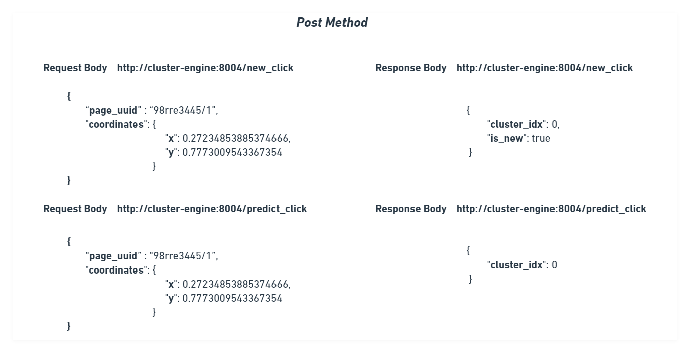

# Assignment Submission - Abhishek Pawaskar

### `Important Note`: The documents mentioned of API endpoints `/save_click_and_predict_cluster` & `/predict_cluster` respectively. But the test cases had `/new_click` & `/predict_click`. Hence provisions for all four endpoints are made. Rest of the details are mentioned in the pdf document titled `apprach.pdf` in this repository. 

##  Contents:
###  1. Usage
###  2. Infrastucture
###  3. Project Structure
###  4. Request-Response Structure


##  1. Usage:

###  a. Starting the Cluster-Engine:
```
#turn on docker desktop and type the following commands navigating within project folder

user:/cluster-engine$  docker-compose up
```

###  b. Running test script

```
user:/cluster-engine$  cd tests

user:/cluster-engine$ python3 test.py

```
 
###  c. Turning off Cluster-Engine:
```
#open a new terminal and run the following

user:/cluster-engine$  docker-compose down

```

##  2. Infrastructure:

###  Following is the infrastructure:




##  3. Project Structure:

###  Following is the project structure:



##  4. Request-Response Structure:

###  Following is the project structure:




